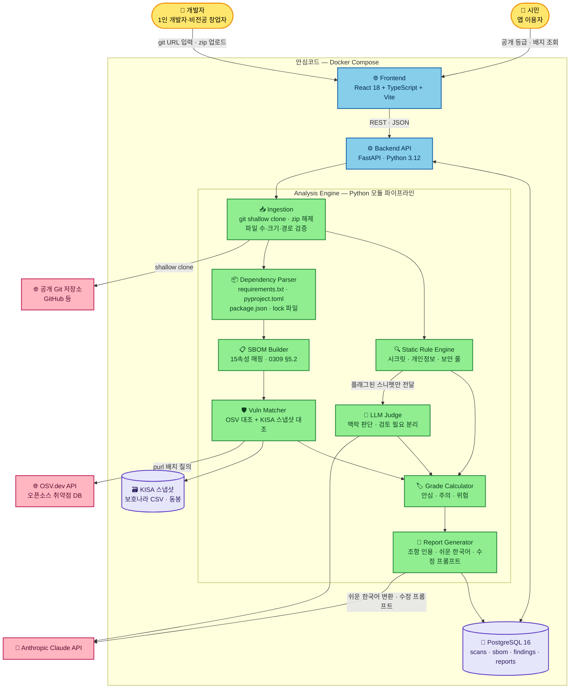
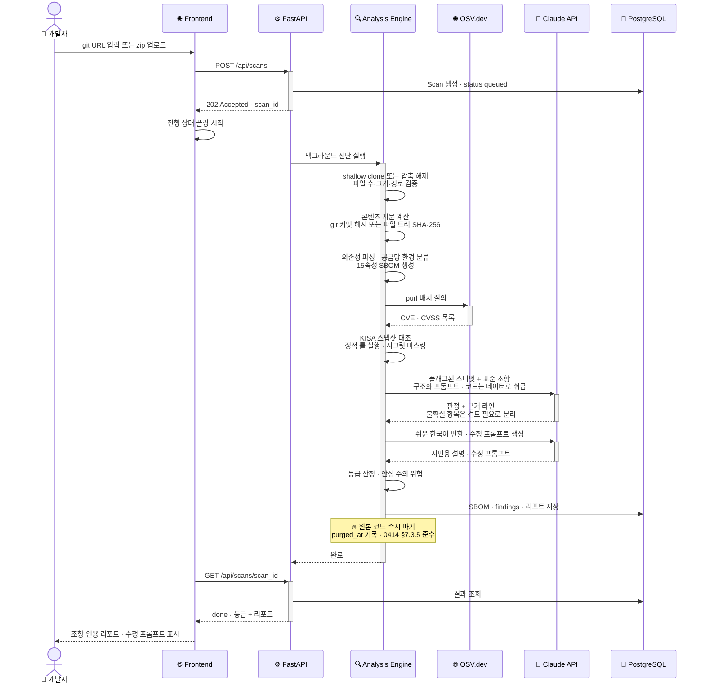
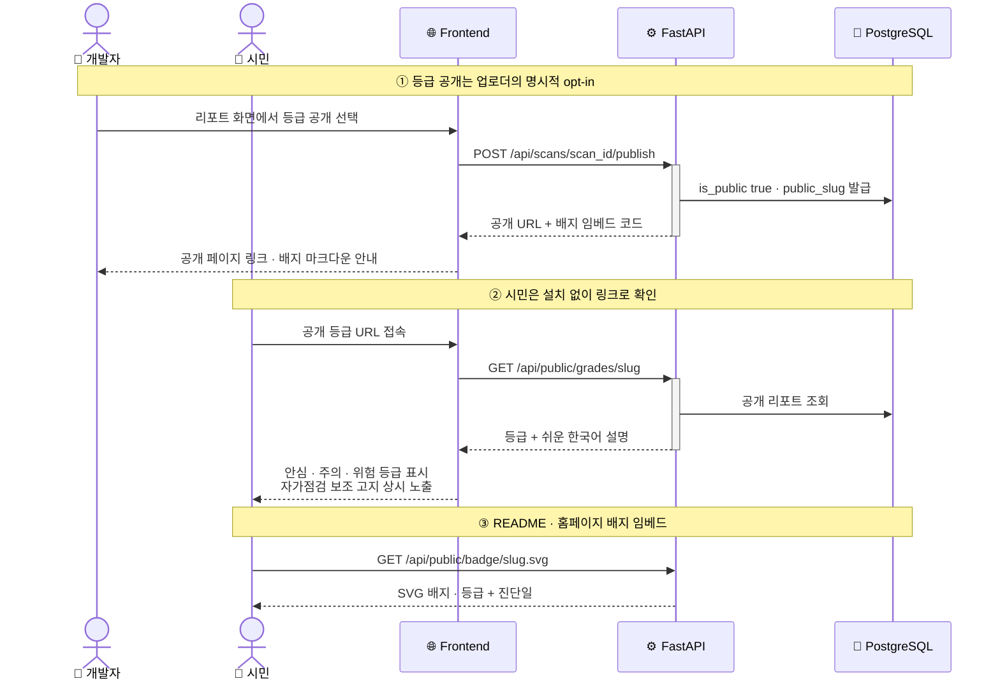
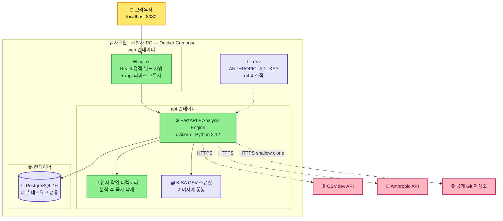

# TDD — 안심코드(AnsimCode): 전 국민 앱 개인정보 검사소

| 항목 | 내용 |
| --- | --- |
| Tech Lead / 개발 | 풀스택 1인 |
| 기획 / PM | 기획 1인 |
| 프로젝트 | 2026 ICT 표준 챌린지 공모전 데모 |
| 기반 문서 | 기획서 v2(협의체 반영), [ADR-001 플랫폼 선정](./platform-decision.md) |
| 버전 | v0.3 |
| Status | Draft |
| Created | 2026-08-24 |
| Last Updated | 2026-08-25 |
| 개발 기간 | 2026-08-24 ~ 2026-08-31 (7일) |

---

## 1. Context

안심코드는 생성형 AI 바이브코딩으로 만들어진 앱의 소스코드를 **TTA 표준 4종의 조항 단위로 자동 진단**하는 웹 서비스다. 소스코드를 올리면 표준 조항에서 도출한 진단 룰 약 30종으로 검사하고, 발견 사항마다 근거 조항·코드 위치·수정 프롬프트를 제시하며, 개발자용 조항 인용 리포트와 시민용 쉬운 한국어 설명, 공개 안전등급(안심·주의·위험)을 함께 제공한다.

**활용 표준과 구현 매핑** (제안서 확정 사항):

| 표준 | 조항 | 구현 대상 |
| --- | --- | --- |
| TTAK.KO-11.0309/R1 (SBOM 속성 규격) | §5.2, §6.1 | 15속성 SBOM 출력 스키마, 스캐닝 도구 자체 |
| TTAK.KO-11.0259/R1 (보안취약점 관리 지침) | §9.3 | 감사보고서형 리포트(플래그 파일마다 해결법), 미선언 의존성·구버전 패치·시크릿 검사 룰 |
| TTAK.KO-12.0414 (AI 서비스 개인정보보호) | §7.3 | 개인정보 생명주기 진단 룰 9종. §7.1~7.2(조직 요구사항)는 체크리스트 안내 |
| TTAK.KO-11.0322 (SBOM 거버넌스) | §5.1~5.2 | 공급망 환경 자동 분류(자체개발·오픈소스·바이너리), 재진단 기능 |

**Stakeholders**: 보안 인력이 없는 1인 개발자·비전공 창업자·소상공인(직접 수혜), 앱을 쓰는 시민(최종 수혜), 공모전 심사위원(데모 평가).

**차별점**: 해외 Aikido·VibeCheck는 OWASP/CVE 기준, 국내 CodeScan·VibeSec은 배포된 웹의 외형만 점검. TTA 표준 조항을 진단 룰로 구현해 조항을 인용하는 도구와 15속성 규격 SBOM 생성 도구는 국내외 미확인.

## 2. Problem Statement & Motivation

### 해결하려는 문제

- **검증 없는 바이브코딩 앱의 대량 배포**: AI 생성 코드의 45%가 보안취약점 포함(Veracode, 2025), 바이브코딩 앱 5,600개에서 개인정보 노출 175건 확인(Escape.tech).
- **표준과 현장의 단절**: TTA 표준은 존재하지만 1인 개발자는 읽지 않는다. 표준을 코드 진단 결과로 "번역"하는 도구가 없다.
- **시민의 정보 비대칭**: 2025년 개인정보 유출 신고 447건(+45.6%), 62%가 해킹. 시민이 앱의 위험을 확인할 수단이 없다.

### Why Now

- 2026년 9월부터 고의·중과실 대규모 유출에 매출액 최대 10% 과징금 — 사전 자가진단의 공공 제공이 시급.
- 2027년 공공분야 SBOM 제도화 대비.

### 해결하지 않으면

- 법적 책임은 규모를 가리지 않으나 보안 여력은 규모에 비례 — 1인 개발자·소상공인이 처분 위험에 그대로 노출되고, 그 앱을 쓰는 시민의 개인정보 유출이 계속된다.

## 3. Scope

### ✅ In Scope (MVP, 7일)

- 공개 **git URL 입력**(1차) / **zip 업로드 ≤50MB**(2차) — 입력 검증 포함
- 진단 대상 언어: **Python(PyPI) + JavaScript/TypeScript(npm)** (확정)
- 의존성 분석 → **15속성 SBOM 생성**(0309 §5.2) — JSON 다운로드 + 화면 표시
- 취약점 대조: **OSV.dev API** + **KISA 보호나라 공공데이터 CSV 스냅샷**(가산점 항목)
- **진단 룰 약 30종**: SCA 룰 + 시크릿 룰 + 개인정보 9종 룰(0414 §7.3) + 일반 보안 정적 룰
- **LLM 결합 진단**(Claude API 실호출, 확정): 맥락 판단(수집 항목 과다 등), '검토 필요' 분리, 근거 코드 라인 병기
- **이중 리포트**: 개발자용(표준 조항 인용, §9.3 감사보고서 형식) + 시민용(쉬운 한국어)
- 발견 사항별 **수정 프롬프트** 생성(사용자의 AI 도구에 붙여넣는 용도)
- **안전등급 산정**(안심·주의·위험) + **공개 페이지(opt-in)** + **SVG 배지**
- **재진단**(0322 지속적 SBOM 갱신) — 수정 후 같은 소스로 재실행, 등급 갱신
- **공급망 환경 자동 분류**(자체개발·오픈소스·바이너리, 0322 §5.1)
- §7.1~7.2 조직 요구사항 **체크리스트 안내 화면**
- **벤치마크 앱**(취약점을 심은 샘플 1개) + 룰별 검출률 측정
- Docker Compose 로컬 기동 + 데모 영상 (제출 형태 확정)

### ❌ Out of Scope (MVP)

- 로그인/계정 — 진단 세션 UUID 기반으로 대체 (**가정**)
- private repo 연동(OAuth), git provider 웹훅/CI 연동
- Java·Kotlin 등 기타 언어 생태계
- KISA 실시간 API 연동 — CSV 스냅샷으로 대체 (**가정**)
- 클라우드 공개 배포·운영(HTTPS 도메인, 오토스케일링)
- 동적 분석(DAST)·코드 실행 기반 분석 — 보안상 의도적으로 배제
- Electron 데스크톱 앱 — [ADR-001](./platform-decision.md)에 따라 V2
- 다국어(영문) UI, 결제·과금

### 🔮 Future (V2+)

- Electron 로컬 스캔(기밀 코드 기업·공공용, React 코드 재사용)
- private repo·CI 파이프라인 연동, Java 지원, 등급 이력·추이

## 4. Technical Solution

### 4.1 시스템 아키텍처

프론트엔드는 React SPA, 백엔드는 FastAPI 단일 서비스이며 Analysis Engine은 백엔드에 내장된 Python 모듈 파이프라인이다. 진단은 비동기 백그라운드 작업으로 실행되고 프론트엔드가 상태를 폴링한다(**가정**: 7일 규모에서 Celery/Redis 등 별도 작업 큐는 과설계로 판단, FastAPI BackgroundTasks + DB 상태 관리로 충분).

**데이터 흐름 요약**: 입력(git URL/zip) → 검증·전개 → 콘텐츠 지문 계산(파기 전) → 의존성 파싱 → SBOM 15속성 생성 → 취약점 대조(OSV+KISA) → 정적 룰 실행 → 플래그 스니펫만 LLM 판정 → 등급 산정 → 이중 리포트 생성 → **원본 코드 즉시 파기** → 결과 저장(리포트·SBOM·발견 사항만).

### 4.2 기술 스택 선정 이유

| 계층 | 선택 | 이유 |
| --- | --- | --- |
| Backend | Python 3.12 + FastAPI | 팀 선호 스택. 정적 분석에 필요한 Python `ast` 모듈·파서 생태계가 풍부. Pydantic으로 SBOM JSON 스키마 검증. async로 OSV/LLM 외부 호출 병렬화 |
| Frontend | React 18 + TypeScript + Vite | 팀 선호 스택. V2 Electron 전환 시 코드 재사용 가능 |
| DB | PostgreSQL 16 | 팀 선호. JSONB로 SBOM·finding의 가변 구조 저장, 관계형으로 scan-finding 연결 |
| 정적 분석 | Semgrep CE + gitleaks | Semgrep: 단일 엔진으로 Python·JS/TS 겸용, YAML 커스텀 룰의 metadata에 TTA 조항을 직접 기입해 Finding 매핑이 1:1. 레지스트리 룰은 라이선스 제약(non-competing)으로 미사용 — 100% 자체 룰 작성. gitleaks: regex+entropy 시크릿 검출, 단일 바이너리, custom rule(TOML)로 한국 특화 패턴 추가. 둘 다 subprocess + JSON 출력으로 통합(외부 전송 없음, TruffleHog식 실검증은 시크릿 외부 전송이라 원칙상 배제) |
| LLM | Anthropic Claude API | 실호출 확정. **가정**: 판정(judge)은 `claude-sonnet-5`, 쉬운 한국어 변환·수정 프롬프트 생성은 `claude-haiku-4-5`로 비용 절감 |
| 실행 환경 | Docker Compose | 심사 환경 재현성. 데모 제출 형태(로컬 실행 + 영상)와 일치 |

### 4.3 데이터 모델 개요

원본 소스코드는 **DB에 저장하지 않는다.** 임시 작업 디렉토리에서만 존재하고 분석 완료 즉시 삭제하며, 삭제 시각을 `purged_at`으로 기록한다. 파기 전에 콘텐츠 지문(git: 커밋 해시, zip: 정규화 파일 트리 SHA-256 — 경로 정렬 후 파일별 해시의 목록 해시, 제외 규칙 동일 적용)을 계산·기록해, 파기 이후에도 등급의 판정 대상을 특정할 수 있게 한다.

| 엔티티 | 핵심 필드 | 설명 |
| --- | --- | --- |
| `Scan` | id(UUID), source_type(git\|zip), source_ref, status(queued\|running\|done\|failed), supply_chain_class(자체개발\|오픈소스\|바이너리), grade(안심\|주의\|위험), content_fingerprint, fingerprint_type(git_commit\|tree_hash), rule_catalog_version, llm_model_id, is_public, public_slug, created_at, purged_at | 진단 1회. 재진단은 같은 source_ref의 새 Scan으로 이력 연결. 지문·룰 버전·모델 ID는 파기 전에 확정 기록(공개 등급 재현성) |
| `SbomComponent` | scan_id(FK) + 0309 §5.2의 15속성: validation_tool, supplier, author, component_name, version, unique_id(purl), component_hash, license_name, license_usage, vulnerability_db, relationship, release_date, cve_ids[], cvss_base_score, cvss_severity | 표준 15속성을 1:1 컬럼 매핑. JSON export는 이 테이블에서 생성 |
| `Finding` | scan_id(FK), rule_id, severity, file_path, line, evidence(마스킹 처리), status(confirmed\|review_needed), fix_prompt, easy_description | 발견 사항. LLM 판정 항목은 `review_needed`로 분리(제안서 요구) |
| `Rule` | id, standard_ref(예: TTAK.KO-12.0414 §7.3.4), title, type(sca\|static\|llm), severity_default | 진단 룰 카탈로그. 리포트의 조항 인용 출처 |

### 4.4 API 개요

| Endpoint | Method | 설명 |
| --- | --- | --- |
| `/api/scans` | POST | git URL 또는 zip(multipart)으로 진단 시작 → `202 {scan_id}` |
| `/api/scans/{id}` | GET | 상태·진행 단계 조회(폴링용) |
| `/api/scans/{id}/report` | GET | 개발자용 조항 인용 리포트. `?mode=easy`로 시민용 |
| `/api/scans/{id}/sbom` | GET | 15속성 SBOM JSON |
| `/api/scans/{id}/checklist` | GET | §7.1~7.2 조직 요구사항 체크리스트 |
| `/api/scans/{id}/rescan` | POST | 같은 소스로 재진단(0322 지속 갱신) |
| `/api/scans/{id}/publish` | POST | 등급 공개 opt-in → 공개 슬러그 발급 |
| `/api/public/grades/{slug}` | GET | 시민용 공개 등급 페이지 데이터 — 콘텐츠 지문·룰 버전 포함, zip 출처는 "소스 비공개" 라벨 |
| `/api/public/badge/{slug}.svg` | GET | README 임베드용 SVG 배지 |

### 4.5 진단 룰 카탈로그 개요 (~30종)

**가정**: 총 30종 목표는 아래 4개 그룹으로 구성하며, 그룹 내 개별 룰의 최종 수는 구현 중 확정. 정적 룰은 Semgrep 커스텀 룰(YAML, metadata에 근거 조항 기입), 시크릿 룰은 gitleaks custom rule(TOML)로 구현하며, `rules/` 디렉토리의 콘텐츠 해시가 곧 `rule_catalog_version`이 된다. 미선언 의존성 검출은 Python은 stdlib `ast`의 import 추출, JS/TS는 Semgrep 패턴으로 import/require를 추출해 매니페스트와 대조한다.

| 그룹 | 근거 표준 | 대표 룰 | 방식 |
| --- | --- | --- | --- |
| SCA 룰 (~12종) | 0309 §5.2·§6, 0259 §9.3 | 미선언 의존성(코드 import vs 매니페스트 대조), 구버전·패치 미적용, CVE 매칭(CVSS High/Critical), 라이선스 미확인·결합형태 불명, 컴포넌트 해시·출처 불명 | static + SCA |
| 시크릿 룰 (~5종) | 0259 §9.3 | API 키·토큰·DB 비밀번호 하드코딩, `.env` 커밋, 클라우드 자격증명 패턴 | static(정규식) |
| 개인정보 룰 (9종) | 0414 §7.3 | 아래 별도 표 | static + LLM |
| 일반 보안 정적 룰 (~4종) | 0259 §9.4 보안 활동 | SQL injection 패턴, 디버그 모드 활성, CORS 와일드카드, 안전하지 않은 역직렬화 | static |

**개인정보 9종 룰 (0414 §7.3 생명주기 매핑)**:

| # | 룰 | 근거 조항 | 방식 |
| --- | --- | --- | --- |
| P1 | 수집 항목 최소화 위반 의심(과다 수집) | §7.3.2 | LLM(맥락 판단) |
| P2 | 동의 절차 없는 개인정보 수집 패턴 | §7.3.2 | static + LLM |
| P3 | 민감정보·고유식별정보 별도 동의 부재 | §7.3.2 | static + LLM |
| P4 | 수집 목적 외 이용·제3자 제공 의심 | §7.3.3 | LLM |
| P5 | 가명처리 미흡·재식별 위험 정보 취급 | §7.3.3 | LLM |
| P6 | 암호화 미적용 저장(평문 저장) | §7.3.4 | static |
| P7 | 접근통제·접근권한 제한 부재 | §7.3.4 | static |
| P8 | 접속기록 관리 부재 | §7.3.4 | static |
| P9 | 파기 로직 부재(보존 기한·삭제 경로 없음) | §7.3.5 | static + LLM |

**등급 산정 규칙** (**가정** — 기획과 문구·기준 최종 협의):

- **위험**: Critical/High CVE ≥1, 또는 confirmed 개인정보 룰 위반 ≥1, 또는 시크릿 검출 ≥1
- **주의**: Medium CVE, 또는 review_needed 항목 존재
- **안심**: 위 해당 없음(Low 이하만)
- 등급·리포트에 "인증이 아닌 자가점검 보조" 문구 상시 표기(제안서 확정)

**등급 공개 범위** (확정, [ADR-001 v1.2](./platform-decision.md)):

- git·zip 입력 모두 opt-in 공개 허용. git은 커밋 해시로 공개 저장소에서 판정 대상 검증 가능
- zip은 트리 지문만 남으므로 등급 페이지에 "소스 비공개 — 공개 저장소 검증 불가" 라벨 표시. 개발자가 같은 코드를 재업로드하면 동일 지문으로 "등급 받은 그 코드"임을 입증 가능

### 4.6 외부 의존성

| 의존성 | 유형 | 용도 | 라이선스/비용 |
| --- | --- | --- | --- |
| OSV.dev API | 외부 API | purl 기반 취약점 배치 질의 | 무료, 인증 불필요 |
| KISA 보호나라 KrCERT 게시판 ([data.go.kr](https://www.data.go.kr/data/15155789/fileData.do)) | 공공데이터 | 보안공지·취약점 정보를 진단 DB로 연동(가산점 항목) | 공공누리. CSV 스냅샷을 이미지에 동봉 |
| Anthropic Claude API | 외부 API | 맥락 판정·쉬운 한국어 변환·수정 프롬프트 생성 | 유료(API key), 스니펫 단위 호출로 비용 제한 |
| TTA 표준 문서 4종 | 문서 | 조항 텍스트 인용(리포트 출처 표기) | 출처 명시 인용 |
| Semgrep CE | 정적 분석 엔진 | Python·JS/TS 커스텀 룰 실행 — 자체 룰만 사용, 레지스트리 룰 미동봉 | 엔진 LGPL-2.1, 무료 |
| gitleaks | 시크릿 스캐너 | 하드코딩 시크릿 검출(단일 바이너리, custom rule TOML) | MIT, 무료 |
| pip-requirements-parser · packageurl-python · packaging · semver | Python 라이브러리 | 의존성 매니페스트 파싱, purl 생성, 버전 비교 | Apache-2.0 / MIT / BSD, 무료 |
| GitHub 등 공개 저장소 | 외부 | git URL 입력 시 shallow clone | 공개 repo만 |

### 4.7 시퀀스 다이어그램

**유스케이스 1 — 진단 요청부터 리포트까지** (핵심 경로):

**유스케이스 2 — 등급 공개(opt-in)와 시민 조회·배지**:

### 4.8 배포 구성도

데모 제출 형태(로컬 Docker Compose 실행 + 영상)에 맞춘 구성. 클라우드 배포는 out of scope.

## 5. 대안 비교 (Alternatives Considered)

### 5.1 플랫폼: 웹 vs 데스크톱 vs 하이브리드

상세 분석·외부 리서치는 [ADR-001](./platform-decision.md) 참조.

| 옵션 | 장점 | 단점 | 결론 |
| --- | --- | --- | --- |
| **웹 + 보안 강화** | 시민 공개 등급·배지 성립, 무설치 저마찰 UX, 출품 유형(■웹) 정합, LLM 키가 백엔드에 자연 위치, 업계 표준 모델(Aikido식 즉시 파기) | 코드가 서버를 경유 → 파기·마스킹·업로드 검증 필수 | ✅ **선정** |
| Electron 데스크톱 | 코드가 PC를 떠나지 않음, 용량 제한 없음 | 공개 등급이 성립 안 함(화면 표시 ≠ 공개), LLM 키 프록시 서버가 어차피 필요, 출품 유형 변경 필요, 미서명 앱 경고 | ❌ V2 로드맵 |
| 하이브리드 | 최강의 보안 스토리(코드는 로컬, 등급만 서버) | 앱+서버 2개 표면을 1인·7일에 개발 — 최대 일정 리스크 | ❌ 기간 초과 |

### 5.2 Backend: FastAPI vs Quarkus/Spring vs Node/Express

| 옵션 | 장점 | 단점 | 결론 |
| --- | --- | --- | --- |
| **Python + FastAPI** | 팀 선호, Python `ast`·파서 생태계로 정적 분석 구현 최단, Pydantic 스키마 검증, async 외부 호출 | 대규모 동시성은 상대적 열위(데모 규모 무관) | ✅ **선정** |
| Java + Quarkus/Spring | 팀 가능 스택, 타입 안정성 | 정적 분석·파서 라이브러리 준비 비용, 7일 내 개발 속도 열위 | ❌ 개발 속도 |
| Node/Express | FE와 언어 통일 | Python 대비 분석 도구 생태계 부족, 팀 선호 아님 | ❌ 분석 생태계 |

### 5.3 취약점 DB: OSV.dev vs NVD 미러 vs 상용 DB

| 옵션 | 장점 | 단점 | 결론 |
| --- | --- | --- | --- |
| **OSV.dev API + KISA 스냅샷** | 무료·무인증, purl 단위 배치 질의로 SBOM과 직결, PyPI/npm 커버리지 우수. KISA 병행으로 국내 공지 반영 + 공공데이터 가산점 | 외부 API 의존(장애 시 부분 결과) | ✅ **선정** |
| NVD 전체 미러 | 오프라인 완결 | 수 GB 동기화·매칭 로직 자체 구현 — 7일 내 불가 | ❌ 구축 비용 |
| 상용 DB(Snyk 등) | 데이터 품질 | 유료·라이선스 제약, 공모전 데모에 부적합 | ❌ 비용·라이선스 |

## 6. Risks

| 리스크 | Impact | Probability | 완화 방안 |
| --- | --- | --- | --- |
| 7일 일정 초과 | High | High | MVP 경계선 사전 정의(§7), 목업 대체 우선순위 명시, 마지막 마일스톤(M7)에 버그 수정 버퍼 확보 |
| LLM 오탐 → 등급 신뢰성 훼손 | High | Medium | LLM 판정을 '검토 필요'로 분리(확정 진단과 구분), 근거 코드 라인 병기, 벤치마크 앱으로 룰별 검출률 측정·공개 |
| LLM 프롬프트 인젝션(코드 주석으로 등급 조작) | High | Medium | 코드를 데이터로 취급하는 구조화 프롬프트, LLM 단독으로 등급 상향 불가(정적 룰 결과가 우선) |
| OSV API 장애·지연 | Medium | Medium | 응답 캐시, 타임아웃 시 KISA 스냅샷만으로 부분 결과 + "일부 미대조" 표시 |
| 악성 업로드(zip bomb·path traversal) | High | Low | 압축 해제 상한(파일 수·총 크기), 경로 정규화 검증, 격리 작업 디렉토리, 코드 실행 금지 |
| LLM 비용·쿼터 초과 | Medium | Medium | 플래그 스니펫만 전달, 스캔당 호출 상한, judge/변환 모델 이원화(sonnet/haiku) |
| 진단 룰 품질(오탐·미탐) | Medium | High | 벤치마크 앱 기반 룰별 검출률 측정을 데모 전 게이트(M7)로 설정, 미탐 룰은 데모 시나리오에서 제외 |
| 공개 등급의 재현성(코드 파기 후 판정 근거 검증 불가) | Medium | High | 콘텐츠 지문 + rule_catalog_version + llm_model_id를 스캔마다 기록해 판정 대상·기준을 특정. zip 등급은 "소스 비공개" 라벨로 한계 고지 |
| Semgrep 레지스트리 룰 라이선스 저촉 | Medium | Low | 레지스트리 룰(Semgrep Rules License — non-competing·non-SaaS 제한)은 동봉·사용하지 않고 100% 자체 작성 룰만 사용. 엔진(LGPL-2.1)은 subprocess 호출로만 사용 |
| Anthropic API 장애(데모 중) | High | Low | 데모 리허설 시점의 응답 캐시를 폴백으로 준비(실호출 우선, 장애 시에만 사용) |

## 7. Implementation Plan

마일스톤과 선후행 관계만 정의한다(상세 일정은 별도 관리). 개발은 풀스택 1인, 기획은 룰 문구·등급 기준·체크리스트 카피·데모 시나리오·영상을 담당한다.

| 마일스톤 | 산출물 | 선행 조건 |
| --- | --- | --- |
| **M1. 기반 구축** | Docker Compose 3서비스 기동, DB 스키마, Ingestion(git clone·zip 해제 + 검증 + 콘텐츠 지문 계산), Rule 카탈로그 시드 | — |
| **M2. SBOM 생성** | 의존성 파서(PyPI·npm), 15속성 SBOM Builder, 공급망 환경 분류, SBOM JSON export | M1 |
| **M3. 취약점 대조** | OSV 배치 질의, KISA 스냅샷 로더·대조, SCA 룰 완성 | M2 |
| **M4. 룰 엔진 + LLM** | 시크릿·개인정보·일반 보안 정적 룰, LLM Judge 연동(구조화 프롬프트, 검토 필요 분리) | M1 — M2·M3와 병행 가능 |
| **M5. 리포트·등급** | 조항 인용 리포트, 쉬운 한국어 변환, 수정 프롬프트 생성, 등급 산정, §7.1~7.2 체크리스트 | M3, M4 |
| **M6. Frontend 통합** | 업로드→진행률→리포트→공개 페이지→배지 전체 화면, 재진단, opt-in 공개. zip UX는 git URL과 동등 완성도(드래그 앤 드롭·명확한 오류 안내) | M5 |
| **M7. 검증·데모** | 벤치마크 앱 + 룰별 검출률 측정, 데모 영상 촬영(공개 등급 페이지·배지 임베드 시연 장면 포함) | M6 |

**Critical Path**: M1 → M2 → M3 → M5 → M6 → M7 (M4는 M1 완료 후 병행 트랙)

### MVP 경계선

- **반드시 실동작** (목업 불가): git URL/zip 입력 → SBOM 생성 → OSV 대조 → 정적 룰 → 리포트 → 등급 표시. LLM 실호출 1개 이상 시나리오.
- **목업 대체 허용** (일정 압박 시, 이 순서로 포기): ① §7.1~7.2 체크리스트 화면(정적 페이지로 대체) → ② 공급망 환경 분류(단순 규칙으로 축소) → ③ SVG 배지(고정 이미지) → ④ 재진단(새 진단으로 안내) → ⑤ 개인정보 LLM 룰 9종 중 P4·P5(데모 시나리오에서 제외).

## 8. Security Considerations

해당 있음 — 이 서비스는 타인의 소스코드(시크릿 포함 가능)를 취급하므로 보안이 MVP 요구사항이다.

| 영역 | 정책 |
| --- | --- |
| **업로드 코드 보호** | 원본 코드는 임시 디렉토리에서만 존재, 분석 완료 즉시 삭제(`purged_at` 기록). DB에는 리포트·SBOM·발견 사항만 저장. 이 정책 자체가 TTAK.KO-12.0414 §7.3.5(지체 없는 파기)의 자기 적용. 업로드 코드에는 개인정보가 실제로 섞여 들어오므로(Escape.tech 실측: 바이브코딩 앱 5,600개 중 PII 노출 175건) 코드 전체를 개인정보 포함 가능 데이터로 간주 |
| **시크릿 마스킹** | 검출된 시크릿 값은 리포트·DB·로그 어디에도 원문 저장 금지(마스킹된 evidence만 저장) |
| **입력 검증** | zip ≤50MB, 압축 해제 파일 수·총 크기 상한, 경로 정규화(path traversal 차단), symlink 무시, `node_modules`/`venv` 자동 스킵. git은 공개 repo만 shallow clone |
| **코드 실행 금지** | 정적 분석만 수행. 의존성 해석 시 `setup.py` 실행류 일절 배제 |
| **LLM 안전** | 업로드 코드를 데이터로 취급하는 구조화 프롬프트(프롬프트 인젝션 방어), LLM 판정 단독으로 등급 결정 불가, 스니펫 단위 전송(전체 코드 미전송) |
| **API 키 관리** | `ANTHROPIC_API_KEY`는 `.env`(git 미추적)로 주입, 프론트엔드 노출 금지 |
| **공개 등급 통제** | 공개는 업로더 opt-in, "인증이 아닌 자가점검 보조" 고지 상시 표기. 등급에 콘텐츠 지문·룰 버전·모델 ID 기록, zip 출처는 "소스 비공개" 라벨 표시 |
| **인증/개인정보** | 로그인 없음 — 서비스가 수집하는 개인정보 자체가 없음(**가정**: 데모 범위). 실서비스 전환 시 재검토 |

## 9. Testing Strategy

| 유형 | 범위 | 방법 |
| --- | --- | --- |
| Unit | 의존성 파서, 정적 룰, 등급 산정, 업로드 검증 | pytest. 룰별 양성·음성 케이스 |
| Integration | POST /scans → 리포트 완성 E2E happy path | 테스트 fixture 저장소로 전체 파이프라인 1회 관통 |
| **벤치마크 검증** | 룰별 검출률 | 취약점을 의도적으로 심은 벤치마크 앱으로 룰별 검출/미검출 측정, 결과 공개(제안서 확정 사항) — 데모 전 게이트(M7) |
| 수동 | 프론트 전체 흐름, 데모 시나리오 리허설 | 데모 영상 촬영 전 체크리스트 |

## 10. Monitoring & Rollback

- **Monitoring**: 데모 범위에 맞게 간소화 — 구조화 JSON 로그(스캔 단계·소요 시간·외부 API 상태), `/health` 엔드포인트, LLM 호출 수·비용 카운터. 대시보드·알림은 해당 없음(로컬 데모로 운영 트래픽이 없음).
- **Rollback**: 해당 없음 — 프로덕션 배포가 없는 로컬 데모이므로 git revert + 이미지 재빌드로 충분.

## 11. 추후 확정 필요사항

확정되면 본문 해당 섹션에 반영하고 개정 이력에 기록한다. 이미 확정된 사항은 본문과 [ADR-001](./platform-decision.md)에 기록되어 있다(예: 등급 공개 범위 → §4.5).

| # | 항목 | 담당 |
| --- | --- | --- |
| 1 | 등급 산정 기준(§4.5 가정)의 최종 확정 — 특히 '검토 필요'만 있을 때 주의로 볼지 | 기획 |
| 2 | 시민용 공개 페이지의 법적 고지 문구(자가점검 보조·면책) 최종안 | 기획 |
| 3 | LLM 스캔당 호출 상한·예산 상한 수치 | 풀스택 |
| 4 | 벤치마크 앱에 심을 취약점 목록(룰 커버리지 기준) | 기획+풀스택 |

## 개정 이력

| 버전 | 일자 | 내용 |
| --- | --- | --- |
| v0.1 | 2026-08-24 | 최초 작성 — ADR-001 v1.2 확정 사항(콘텐츠 지문·판정 기준 버전 기록, 등급 공개 범위) 반영 포함 |
| v0.2 | 2026-08-25 | Implementation Plan을 일 단위 일정에서 마일스톤·선후행 관계 정의로 변경, Open Questions를 추후 확정 필요사항으로 정리(기한 표현 삭제), API 경로의 버전 표기(/v1/) 제거, 문서 버전 관리 도입 |
| v0.3 | 2026-08-25 | 정적 분석 도구 확정 — Semgrep CE(자체 룰 전용) + gitleaks 채택, 의존성 파싱 라이브러리 명시, rule_catalog_version 산출 방식(rules/ 디렉토리 해시) 정의, 레지스트리 룰 라이선스 리스크 추가 |
